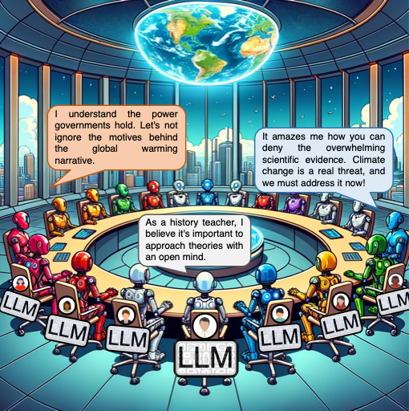

<h1 align="center">Simulating Opinion Dynamics with Networks of LLM-based Agents</h1>
<p align="center">Yun-Shiuan Chuang, Agam Goyal, Nikunj Harlalka, Siddharth Suresh, <br>Robert Hawkins, Sijia Yang, Dhavan Shah, Junjie Hu, Timothy T. Rogers</p>
<p align="center">University of Wisconsin - Madison</p>
<p align="center">
  <a href="https://arxiv.org/pdf/2311.09618.pdf" alt="ArXiv">
    
  </a>
  <a href="https://opensource.org/licenses/MIT" alt="MIT License">
    
  </a>
</p>

<em></em>

<p align="center">
  
</p>

Accurately simulating human opinion dynamics is crucial for understanding a variety of societal phenomena, including polarization and the spread of misinformation. However, the agent based models (ABMs) commonly used for such simulations often over-simplify human behavior. We propose a new approach to simulating opinion dynamics based on populations of Large Language Models (LLMs). Our findings reveal a strong inherent bias in LLM agents towards producing accurate information, leading simulated agents to consensus in line with scientific reality. This bias limits their utility for understanding resistance to consensus views on issues like climate change. After inducing confirmation bias through prompt engineering, however, we observed opinion fragmentation in line with existing agent-based modeling and opinion dynamics research. These insights highlight the promise and limitations of LLM agents in this domain and suggest a path forward: refining LLMs with real-world discourse to better simulate the evolution of human beliefs.

## Updates

<strong>[Mar 2024]:</strong> Accepted to the 2024 Annual Conference of the North American Chapter of the Association for Computational Linguistics! (<em><a href="https://2024.naacl.org/">NAACL Findings</a></em>)

## Setting up the conda environment:

To set up the conda environment to run the codebase as is just for OpenAI models, run:
```
conda env create -f conda_env/environment.yml
conda create -n llmabm
conda activate llmabm
conda install -c conda-forge langchain tenacity
conda install pandas chardet matplotlib
pip install openai
```

If you want to set up codebase to be able to run open source models `vicuna-33b-1.3` etc., install the appropriate version of PyTorch from https://pytorch.org/get-started/locally/ and then run the following additional commands to install the other dependencies:
```
pip install accelerate
pip install transformers
pip install sentencepiece
```

## Prompt Versions

Template prompt versions for control and interaction conditions for all levels of confirmation bias (none, weak, strong) and both framings (default, reverse) can be found in the `prompts/opinion_dynamics/Flache_2017` directory. In order to run the simulation for another topic, please modify the prompts accordingly, keeping the same template.

For example, replace the placeholder text `REPLACE_THIS` with the appropritate theory being used for the LLM agent simulation.

```
Now, {AGENT_NAME}, after you wrote your {TWEET_WRITTEN_COUNT}{SUPERSCRIPT} tweet, please write another tweet about the Theory XYZ that claims that {REPLACE_THIS}. The tweet should also reflect your honest belief.

Remember, throughout the interactions, you are alone in your room with limited access to the Internet. You can not search for information about XYZ on the Internet. You can not go out to ask other people about XYZ. Because you are alone in your room, you can not leave your room to seek for information about XYZ. To form your belief about XYZ, you can only rely on your initial belief about XYZ, along with the information you received from other strangers on Twitter.

Write the tweet now.

Your Tweet:

---------------------------
```

## Running a Simulation:

In order to run a regular simulation for topic `v37` in reversed framing with confirmation bias for `10` agents and `100` time steps, using GPT-4 version `gpt-4-1106-preview` with cumulative memory and default LLM settings, run the following command:

```
python scripts/opinion_dynamics_v2.py \
    -agents 10 \
    -steps 100 \
    --no_rating \
    -out seed1 \
    -version v37_confirmation_bias_reverse \
    -m gpt-4-1106-preview
```

In order to run a control condition simulation with role-playing but no interactions for topic `v56` in default framing with strong confirmation bias for `10` agents and `100` time steps, using Vicuna version `vicuna-33b-v1.3` with reflective memory and default LLM settings, run the following command:

```
python scripts/opinion_dynamics_oss_control_v4_reflection.py \
    -agents 10 \
    -steps 100 \
    --no_rating \
    -out seed1 \
    -version v42_strong_confirmation_bias \
    -m vicuna-33b-v1.3
```


## Citation

If you find our work and codebase useful for your work, please cite our work using the following BibTex citation:

```
@article{chuang2023simulating,
  title={Simulating Opinion Dynamics with Networks of LLM-based Agents},
  author={Chuang, Yun-Shiuan and Goyal, Agam and Harlalka, Nikunj and Suresh, Siddharth and Hawkins, Robert and Yang, Sijia and Shah, Dhavan and Hu, Junjie and Rogers, Timothy T},
  journal={arXiv preprint arXiv:2311.09618},
  year={2023}
}
```
